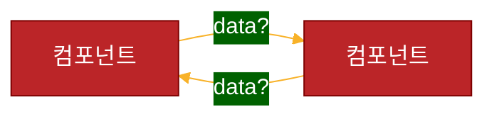

<a href="https://unsplash.com/ko/%EC%82%AC%EC%A7%84/KSQgzzn3dW0"> Maarten van den Heuvel
mvdheuvel (CC, Maarten van den Heuvel
mvdheuvel)</a>

<!--break-->
## index 
--- 
- [index](#index)
- [문제](#문제)
- [풀이](#풀이)
- [recap](#recap)

## 문제 
--- 




개발자라면 이런 고민들을 해보셨을지도 모르겠습니다.

각 객체간 통신은 어떻게 하면 좋을까?

<i>여기서 말하는 통신은 각 객체끼리 어떻게 데이터를 주고 받을지에 대한 내용입니다.</i>

예를 들어 클라이언트는 서버와 통신을 합니다. udp나 tcp등을 통해 통신을 하죠.
저희는 문자나 전화로 통신을 합니다. <b>이제 컴포넌트끼리의 통신은 어떻게 하면 좋을까요?</b>
<h3>🤔</h3>


<br>
<br>

## 풀이 
--- 
어떤 통신이 좋은지에 대한 답은 사실 없습니다.

뭐가 좋을지는 자신의 어플리케이션이나 프로그램 등의 현 상황에 따라 다릅니다.

각 컴포넌트들의 통신은 보통 상위 부모에서 내려주는 데이터를 통해 부모와 자식간의 통신이 일어납니다.

자식이 부모에게 데이터를 받는 것이 일반적인 통신이고 이 순환이 단순해야 프로그램의 복잡도가 내려간다는 것도 동의합니다.


```mermaid


graph TD;
A["A 부모 컴포넌트"]
B["B 자식 컴포넌트"]
C["C 자식 컴포넌트"]

A -->|"data"| B & C
```

하지만 전 조금 다른 방향의 방식을 생각해봅니다.

자바스크립트는 event driven 패러다임이 아주 중요한 언어라는 부분을 활용하는 것이죠

event에 콜백 함수를 걸어놓고 이벤트 발생시 콜백 함수를 실행하는 바로 그 패턴입니다.

이 패턴은 자바스크립트의 핵심적인 모델이기도 합니다.

여러분이 누르는 그 버튼에 달린 이벤트도 바로 그것이죠


그럼 이제 본론으로 돌아가서 제가 하고 싶은 것은 간단합니다.

1. 유저의 입력을 받아내는 form이 있습니다.
2. 유저의 입력을 다 받으면 이벤트를 실행할 버튼이 있습니다.
3. 버튼의 이벤트를 함께 구독하고 있는 데이터 리스트가 있습니다.


보통 위의 세가지가 가장 많이 나오는 개발 요건이죠

입력을 받고 이벤트를 발생시키는 버튼이 있고.. 그 내용들을 그려주는 리스트가 있는 이 세가지 필수 요소들..


```html
<!-- web component input scripts... -->
<input-set url="/todo/addTodo" method="POST"></input-set>

<data-list 
src="/todo/getTodos"
>
</data-list>

<script>
    const input_set = document.querySelector('input-set');
    const data_list = document.querySelector('data-list')
    input_set.addEventListener("_SEND", (event)=>{
        data_list.greet('command!')
    })
</script>
```

input-set이라는 컴포넌트는 내부에 submit 버튼을 가지고 있습니다.

<b>해당 버튼의 콜백 함수에는 이벤트를 발행하는 코드가 있습니다.</b>

```js
    // 당신의 멋진 비즈니스 로직...

      this.dispatchEvent(
        new CustomEvent("_SEND", { detail: { message: "HELLO WORLD!" } })
      );
```

이런 이벤트를 발행한다는게 무엇을 의미할까요? 

해당 이벤트는 이제 전역 변수의 이벤트 버스에 탑승한 것입니다.

마치 pub/sub 패턴과 매우 비슷합니다.

이런 객체를 활용해 개발해보는 것도 자바스크립트의 또 다른
장점을 느끼게 합니다.

<a href="https://developer.mozilla.org/en-US/docs/Web/API/Event">이벤트 객체 설명</a>

개발하기 전에 꼭 위 내용을 확인하고 개발하세요!


<br>
<br>

## recap 
--- 

이벤트는 노드에서 eventEmitter라고 이미 있다.

non blocking을 따르는 js의 특성상 이벤트를 걸어놓고
해당 이벤트가 발생했을 때 어떤 함수를 실행한다는 것은 실로 훌륭한 방식이다.

하지만 non-blocking이다 보니 당신이 발행한 이벤트와
그 이벤트의 실행 시점등을 잘 파악해야 한다.

<br>
<br>

